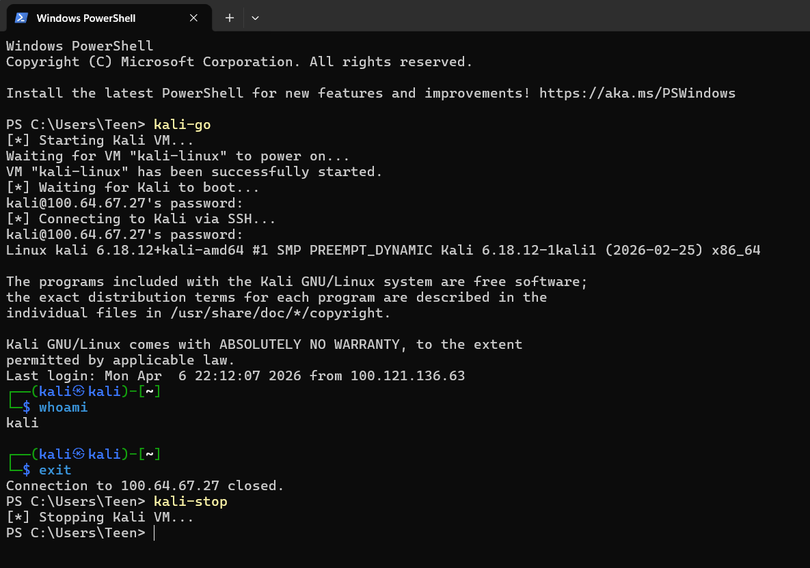

# Automated Remote Lab (Kali VM + Tailscale + SSH)

An automated workflow for remote Hack The Box labs, designed to instantly link my laptop to a home-based Kali VM. This setup handles all networking and OpenVPN services, providing one-command access to my high-performance desktop from any location.


 
>### Workflow

Laptop → one-command  → Home desktop 

`kali-go` = start Kali linux VM → SSH connect to kali → Auto connect to HTB OpenVPN

`kali-stop` = end Kali linux VM 


## What I Built

- Tailscale used as secure network layer (no port forwarding)  
- Remote VirtualBox control via SSH over Tailscale  
- Auto-connect to HTB OpenVPN on every boot up 
- SSH key-based authentication (password disabled)
- Headless Kali Linux startup using custom PowerShell function 



---

## Issue Encountered

SSH login failed after switching to key-based authentication.

Error:
Permission denied (publickey)


### Investigation
```
Initial assumptions:
- Incorrect key placement  
- Wrong file permissions  
- User or group misconfiguration  

Verified:
- Public key exists in authorized_keys  
- Permissions are correctly set  
- User configuration is valid  
```

### What works for me

[Reference](https://woshub.com/using-ssh-key-based-authentication-on-windows/)

- Commented out the Match Group administrators directive in sshd_config
- Restarted SSH service

This overrides the default key location and uses:
C:\ProgramData\ssh\authorized_keys

---

### Future Updates


1. Still need to manually enter SSH password for Kali VM.

---
[Home](../README.md) 