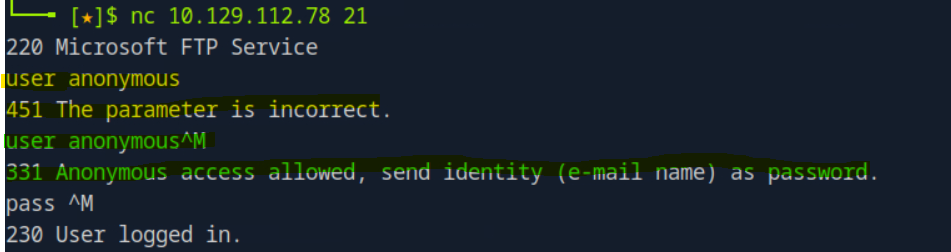

# Netcat FTP Command Issue: Missing Carriage Return (\r)


### Issue Encountered (Highlighted in yellow)

FTP commands failed or returned unexpected responses when typed manually into Netcat.
The server shows result "The parameter is incorrect" after pressing Enter.

### Cause
```
FTP requires commands to end with:

\r\n  (Carriage Return + New Line)

However, pressing Enter in a standard Linux terminal through Netcat only sends \n

As a result, the FTP server treats the command as incomplete.
```
### Resolution (Highlighted in green)

Manually insert the required return and newline characters.

>[Ctrl + V] [Enter] [Enter]


After sending proper \r\n termination, FTP processed commands correctly.

---
[Home](../README.md) 